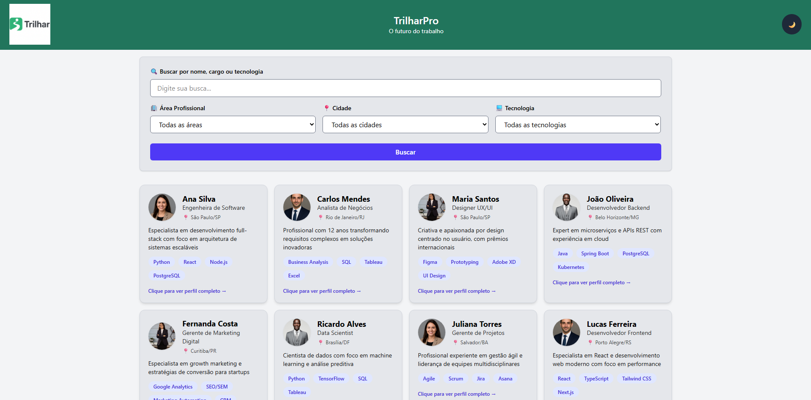

# 📌 TrilharPro — Plataforma Profissional para o Futuro do Trabalho

**TrilharPro** é uma plataforma web inspirada no conceito de redes profissionais modernas, como o LinkedIn, projetada para conectar pessoas, competências e propósitos, tudo por meio de uma interface moderna, responsiva e totalmente funcional. A aplicação foi desenvolvida como parte da **Global Solution 2025**, atendendo ao tema _“O Futuro do Trabalho – Conectando pessoas, competências e propósito por meio da tecnologia”_.

A aplicação apresenta profissionais fictícios carregados via JSON local, permitindo buscas, filtros, visualização detalhada de perfis e interação por meio de ações simuladas.

---



---

## 🛠️ Tecnologias Utilizadas

- **React + Vite**
- **Tailwind CSS**
- **JavaScript**
- **HTML5**
- **JSON (dados simulados)**
- **Git & GitHub**

---

## 🔧 Instalação e Execução (passo a passo)

### 1️⃣ Clone o repositório  
```bash
git clone https://github.com/TrilharPRO-GS/Front-Web.git
```

### 2️⃣ Instale as depências e execute o backend
```bash
cd backend
npm install
npm run backend
```

### 3️⃣ Instale as depências e execute o frontend
```bash
cd frontend
npm install
npm run dev
```

## 👩‍💻 Autores
Projeto desenvolvido por:  
- Rodrigo Tadeo - 562010  
- Vinicius Cavalcanti - 562063  

---
### Link do repositório: <code>https://github.com/TrilharPRO-GS/Front-Web.git</code>